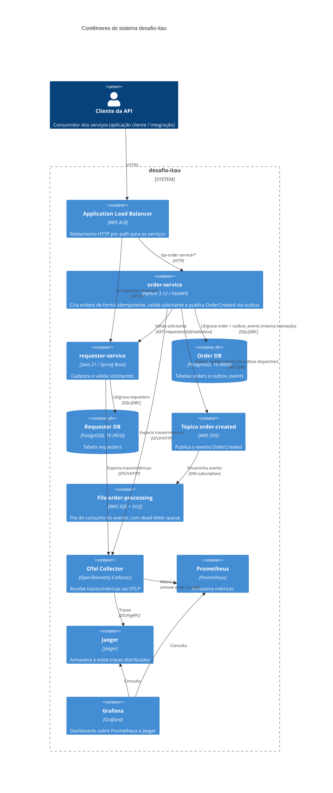
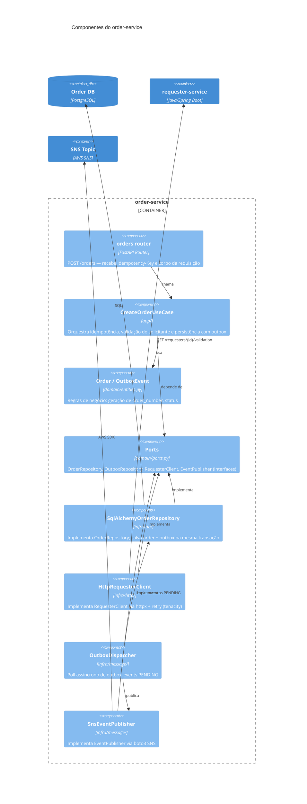
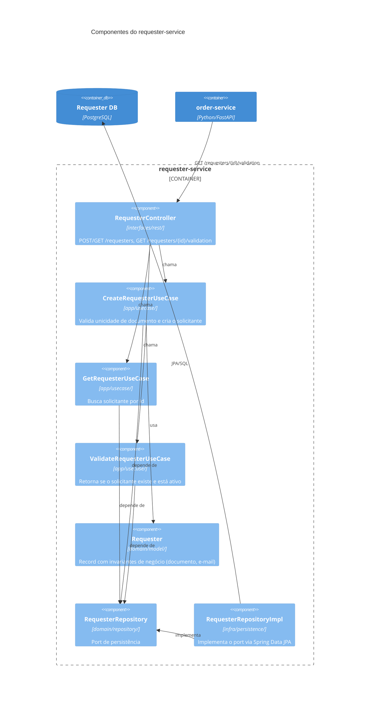
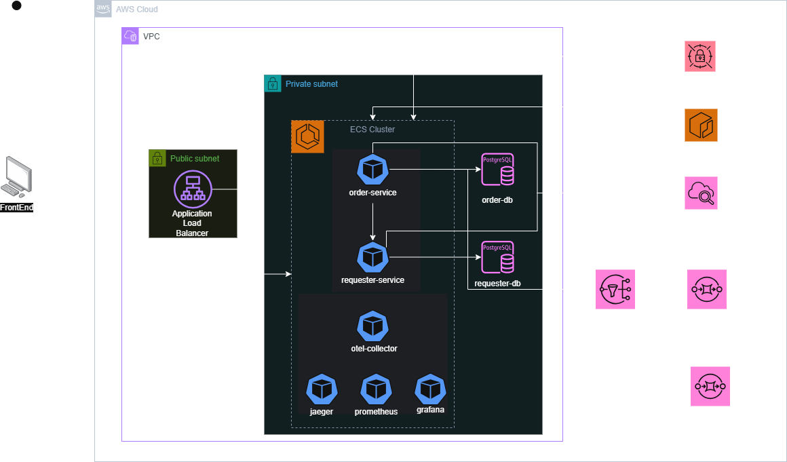
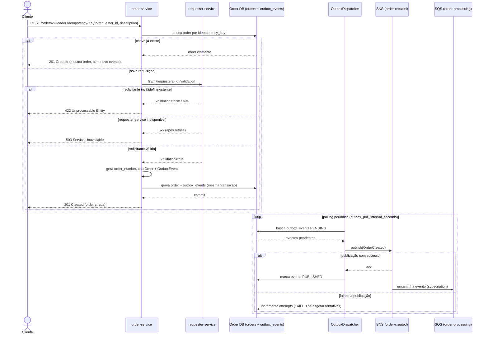

# desafio-itau

Documentação central do projeto **desafio-itau**: escopo da solução, decisões de arquitetura (ADRs) e diagramas (C4, infraestrutura e fluxo) que amarram os repositórios de código e infraestrutura do sistema.

## Sumário

- [Escopo do projeto](#escopo-do-projeto)
- [Repositórios](#repositórios)
- [Documentação complementar (ADRs e draft)](#documentação-complementar-adrs-e-draft)
- [Diagrama C4 — Nível 2 (Contêineres)](#diagrama-c4--nível-2-contêineres)
- [Diagrama C4 — Nível 3 (Componentes)](#diagrama-c4--nível-3-componentes)
- [Diagrama de Infraestrutura](#diagrama-de-infraestrutura)
- [Diagrama de Fluxo](#diagrama-de-fluxo)

## Escopo do projeto

O desafio-itau é um sistema de **registro de ordens de serviço** ("ordens") vinculadas a um **solicitante** cadastrado previamente. É composto por dois microsserviços poliglotas que se comunicam de forma síncrona (validação) e assíncrona (evento de domínio), além da infraestrutura AWS que os sustenta:

- **[`requester-service`](../requester-service/README.md)** (Java/Spring Boot): mantém o cadastro de solicitantes (documento, nome, e-mail, status ativo/inativo) e expõe um endpoint de validação consumido pelo `order-service`.
- **[`order-service`](../order-service/README.md)** (Python/FastAPI): cria ordens de forma idempotente, validando o solicitante contra o `requester-service`, e publica de forma confiável o evento `OrderCreated` via outbox pattern + SNS/SQS.
- **[`infrastructure`](../infrastructure/README.md)** (Terraform): provisiona todo o ambiente AWS — rede, ECS Fargate, RDS, SNS/SQS, ALB e a stack de observabilidade (OpenTelemetry, Prometheus, Jaeger, Grafana).
- **[`terraform-backend`](../terraform-backend/README.md)** (Terraform): bootstrap do backend remoto de estado (bucket S3 + tabela DynamoDB de lock) usado pelo `infrastructure`.

O rascunho original da solução (ver [draft](#documentação-complementar-adrs-e-draft)) previa também um frontend em Angular para cadastro de solicitantes e criação de ordens; esse frontend **não faz parte dos repositórios entregues** — o escopo implementado cobre as duas APIs backend, a infraestrutura e a observabilidade descritas acima.

Garantias de negócio centrais do sistema (detalhadas nos ADRs):

- **Idempotência** na criação de ordens via header `Idempotency-Key` ([ADR 0003](docs/0003-idempotency-key-header.md)).
- **Consistência entre persistência e mensageria** via transactional outbox ([ADR 0004](docs/0004-outbox-pattern.md)).
- **Entrega confiável** do evento `OrderCreated` via SNS + SQS com DLQ ([ADR 0002](docs/0002-messaging-sns-sqs.md)).
- **Observabilidade vendor-neutral** via OpenTelemetry, com métricas no Prometheus e tracing no Jaeger, visualizados no Grafana ([ADR 0005](docs/0005-observability-opentelemetry.md)).

## Repositórios

| Repositório | Linguagem/Stack | Responsabilidade |
|---|---|---|
| [`order-service`](../order-service/README.md) | Python 3.12 / FastAPI | Criação idempotente de ordens, validação do solicitante, outbox + publicação SNS |
| [`requester-service`](../requester-service/README.md) | Java 21 / Spring Boot 4 | Cadastro e validação de solicitantes |
| [`infrastructure`](../infrastructure/README.md) | Terraform | Provisionamento da infraestrutura AWS de execução (rede, ECS, RDS, mensageria, observabilidade) |
| [`terraform-backend`](../terraform-backend/README.md) | Terraform | Bootstrap do backend remoto de estado do Terraform |
| `documentation` (este repositório) | Markdown | ADRs, draft da solução e diagramas |

## Documentação complementar (ADRs e draft)

As decisões arquiteturais estão registradas como Architecture Decision Records em [`docs/`](docs):

| ADR | Decisão |
|---|---|
| [0001](docs/0001-compute-ecs-fargate.md) | Compute: ECS Fargate (em vez de EKS ou Lambda) |
| [0002](docs/0002-messaging-sns-sqs.md) | Mensageria: SNS + SQS (em vez de MSK/Kafka ou EventBridge) |
| [0003](docs/0003-idempotency-key-header.md) | Idempotência via header `Idempotency-Key` |
| [0004](docs/0004-outbox-pattern.md) | Outbox pattern para publicação confiável de eventos |
| [0005](docs/0005-observability-opentelemetry.md) | Observabilidade: OpenTelemetry + Grafana/Prometheus/Jaeger |
| [0006](docs/0006-liquibase-migrations.md) | Migração de schema com Liquibase nos dois serviços |
| [0007](docs/0007-cicd-static-aws-credentials.md) | CI/CD: GitHub Actions com credenciais AWS estáticas |

O rascunho inicial da solução está em [`docs/draft.png`](docs/draft.png) — um esboço de alto nível do fluxo cliente → frontend → `requester-service`/`order-service` → SNS/SQS, usado como ponto de partida antes do detalhamento em ADRs e nos diagramas C4 abaixo.

## Diagrama C4 — Nível 2 (Contêineres)

## Diagrama C4 — Nível 3 (Componentes)

Ambos os serviços seguem arquitetura hexagonal (ports & adapters): domínio isolado de framework, casos de uso dependendo apenas de ports, e adapters de entrada (HTTP) e saída (persistência, HTTP client, mensageria) plugados nas bordas.

### order-service

### requester-service

## Diagrama de Infraestrutura

Infraestrutura provisionada pelo repositório [`infrastructure`](../infrastructure/README.md) (ver módulos Terraform: `network`, `security`, `database`, `messaging`, `ecs`, `observability`).

## Diagrama de Fluxo

Fluxo de criação de uma ordem, incluindo validação síncrona do solicitante e publicação assíncrona confiável via outbox pattern ([ADR 0003](docs/0003-idempotency-key-header.md) e [ADR 0004](docs/0004-outbox-pattern.md)).

